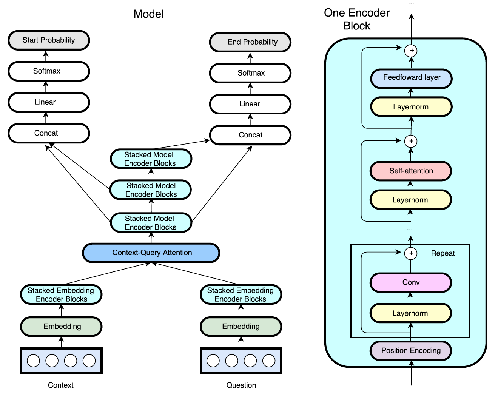

# QANet

A TensorFlow implementation of Google's [QANet](https://openreview.net/pdf?id=B14TlG-RW). The starter code is from [this repo](https://github.com/abisee/cs224n-win18-squad). Contributions are welcome!

<p align="center"> 

</p>

## Requirements
* python 3.6
* numpy 1.14.2
* tensorflow 1.8.0
* tensor2tensor 1.8.0
* colorama 0.3.9
* nltk 3.2.5
* six 1.11.0
* tqdm 4.24.0

## Usage

To install requirements in a new [conda environment](https://conda.io/docs/user-guide/getting-started.html), download [SQuAD](https://rajpurkar.github.io/SQuAD-explorer/) dataset and pretrained [GloVe embeddings](https://nlp.stanford.edu/projects/glove/), and preprocess the data, run

```bash
bash get_started.sh
```

There are 3 modes: `train`, `show_examples`, and `official_eval`. Before entering each mode, make sure to activate the `qanet` environment and enter the `code/` directory; to do so, run

```bash
source activate qanet
cd code
```

### Train

To start training, run (please replace `<EXPERIMENT NAME>` by an experiment name, such as `qanet`)

```bash
python main.py --experiment_name=<EXPERIMENT NAME> --mode=train
```

Hyperparameters are stored as flags in `code/main.py`. Please refer to `code/modules.py` and `code/qa_model.py` for details.

Training results would be stored under `experiments/<EXPERIMENT NAME>`.

### Show Examples

To see example output, run

```bash
python main.py --experiment_name=<EXPERIMENT NAME> --mode=show_examples
```

Ten random dev set examples would be printed to screen, comparing the true answer to the model's predicted answer, and giving the F1 and EM score for each example.

### Official Eval

To obtain the predictions on the dataset by the model, run

```bash
python main.py --experiment_name=<EXPERIMENT NAME> --mode=official_eval \
--json_in_path=../data/dev-v1.1.json \
--ckpt_load_dir=../experiments/<EXPERIMENT NAME>/best_checkpoint
```

The predictions of the model would be stored in `experiments/<EXPERIMENT NAME>/predictions.json`.

To run the official SQuAD evaluation script on the output, run

```bash
python evaluate.py ../data/dev-v1.1.json ../experiments/<EXPERIMENT NAME>/predictions.json
```

### Tensorboard

To track progress in tensorboard, run

```bash
tensorboard --logdir=. --port=8888
```
